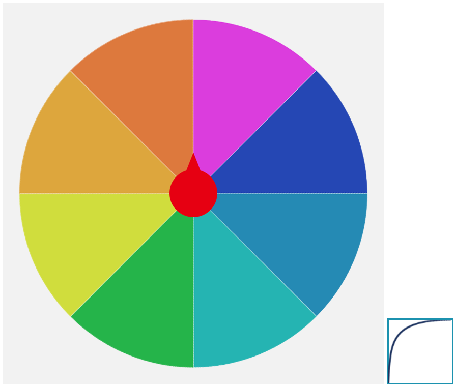

# canvas-wheel-of-fortune

*原生canvas幸运转盘，适合大部分转盘游戏功能需求，通过贝塞尔曲线控制速度。理论上支持小程序，源码不复杂，有需要的同学可以自己修改*

## 目录

* [安装](#安装)
* [示例](#示例)
* [配置参数](#配置参数)

## 安装

npm:
```sh
 npm install canvas-wheel-of-fortune
```

CDN:
```html
<script src="./../dist/wheel.min.js"></script>
```

## 示例
>克隆这个仓库，用浏览器打开example目录下index.html文件查看效果



```javascript

    // 奖品的信息，顺时针以角度区分
    const prizeInfo = [
        {
            name: '深紫罗兰色',
            ds: [0, 45]
        },
        {
            name: '海军蓝',
            ds: [45, 90]
        },
        {
            name: '缥色',
            ds: [90, 135]
        },
        {
            name: '青緑',
            ds: [135, 180]
        },
        {
            name: '緑',
            ds: [180, 225]
        },
        {
            name: '若草色',
            ds: [225, 270]
        },
        {
            name: '栀子色',
            ds: [270, 315]
        },
        {
            name: '黄茶',
            ds: [315, 360]
        },
    ]

    // 贝塞尔控制点
    const para = [.04, .63, 0, 1]

    // 将网络图片转为img对象
    function downloadImg(arrImgUrl) {
        return new Promise((resolve, reject) => {
            Promise.all(arrImgUrl.map(path => new Promise((resolve, reject) => {
                const img = new Image();
                img.onload = () => {
                    resolve(img);
                };
                img.src = path;
            }))).then(resolve)
        })
    }

    // 获取canvas对象
    const ele = document.getElementById('canvas');
    // 设置canvas画布尺寸
    ele.height = 200;
    ele.width = 200;
    const canvas = ele.getContext('2d');

    // 下载网络图片
    downloadImg(['http://space.webhole.online/wheel.png', 'http://space.webhole.online/pointer_center.png']).then(res => {

        /**
         *  spinNum 旋转的圈数
         *  prizeInfo 奖品信息
         *  canvas getContext获取到的canvas对象
         *  canvasW canvas宽度
         *  canvasH canvas高度 通常和宽度一样
         *  bgc 圆盘图
         *  poin 指针图
         *  poinCenter 指针是否在画布中心
         *  poinWidth 指针图的宽，高会按照原图的比例自动计算
         **/

        // 获取Fortune实例
        const cvs = new wheel.Fortune({ spinNum: 4, prizeInfo, canvas, canvasW: 600, canvasH: 600, bgc: res[0], poin: res[1], poinCenter: true, poinWidth: 60 });
        
        // 传入贝塞尔控制点，默认是匀速转动，
        cvs.bez(...para);

        // 开始画面绘制
        cvs.translate();
        cvs.drawRotateWheel(0);
        cvs.darwPoinDeg();
        cvs.recoTranslate();

        // 点击开始按钮转动
        document.getElementById('start').addEventListener('click', () => {
            // 传入prizeInfo数组索引可指定获奖对象。不传入索引则随机转动，每个奖项获奖概率相同。如果每个奖项抽中概率不同可以先按照概率算出索引
            cvs.start(2).then(res => {
                // 转动结束得到的结果
                console.log(res);
            });
        });

    });
```

## 配置参数
Fortune Object
```javascript
new Fortune({

    // 指针是否居中
    poinCenter: Boolean,

    // 贝塞尔计算点相乘的倍数，控制这个大小，可以控制转动速度。默认 40
    coeDou: Number,

    // 角度阈值，比如不想让指针转动到奖项与奖项之间的分界处可改变这个。 默认 5
    thre: Number,

    // 贝塞尔计算点的数量。默认 100
    poinNum: Number,

    // 每秒绘制图像的次数。默认 60
    fps: Number,

    // 奖项信息，具体数据格式参考示例
    prizeInfo: Array,

    // 在转动多少圈之后结束转动。默认 3
    spinNum: Number,

    // getContext获取到的canvas对象
    canvas: Object,

    // canvas对象的宽度
    canvasW: Number,

    // canvas对象的高度
    canvasH: Number,

    // 转盘图
    bgc: Image,

    // 指针图
    poin: Image,

    // poinWidth 指针图的宽，高会按照原图的比例自动计算
    poinWidth: Number,

    // 指针x位置 poinCenter 设置为true时可不配置
    poinX: Number,

    // 指针y位置 poinCenter 设置为true时可不配置
    poinY: Number,

    // 指针转动的角度，转动中心为画布中心
    poinDeg: Number,

    // 指针转动的基础速度，效果和设置coeDou差不多。默认 10
    rate: Number
})
```

>贝塞尔算法参考 
>https://segmentfault.com/a/1190000018597975


## License
MIT

